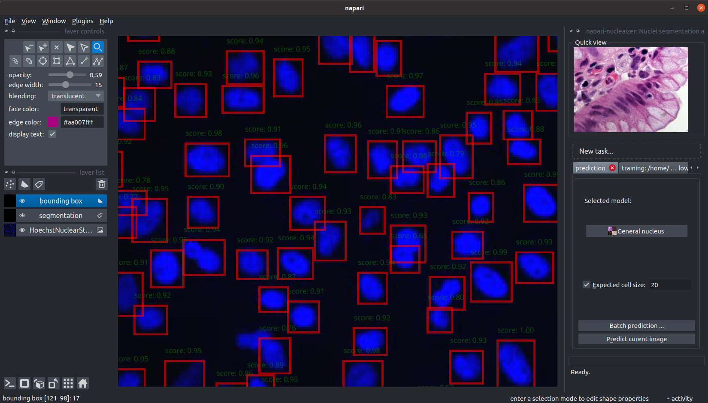
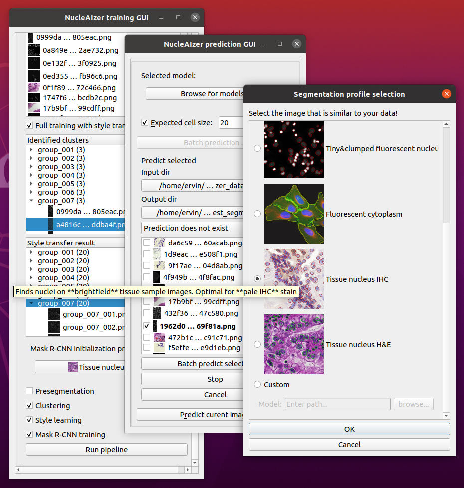
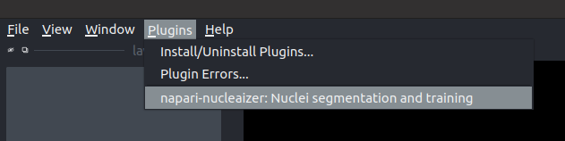

# napari_nucleaizer

<!--

-->

GUI for the nucleaAIzer method in Napari.

## Overview

This is a napari plugin to execute the nucleaizer nuclei segmentation algorithm.

### Main functionalities

Using this plugin will be able to

1. Load your image into Napar, then outline the nuclei.
2. Specify an image folder containing lots of images and an output folder, and automatically segment all of the images in the input folder.
3. If you are not satisfied with the results, you can train your own model:
    1. You can use our pretrained models and fine tune them on your data.
    2. You can skip the nucleaizer pipeline and train only on your data.

### Supported image types

We have several pretrained models for the following image modelities:
* fluorescent microscopy images
* IHC stained images
* brightfield microscopy images,

among others. For the detailed descriptions of our models, see: https://zenodo.org/record/6790845.

### How it works?

For the description of the algorithm, see our paper: "Hollandi et al.: nucleAIzer: A Parameter-free Deep Learning Framework for Nucleus Segmentation Using Image Style Transfer, Cell Systems, 2020. https://doi.org/10.1016/j.cels.2020.04.003"

The original code (https://github.com/spreka/biomagdsb) is partially transformed into a python package (nucleaizer_backend) to actually perform the operations. See the project page of the backend at: https://github.com/etasnadi/nucleaizer_backend.

If you wish to use the web interface, check: http://nucleaizer.org.

<!--
Don't miss the full getting started guide to set up your new package:
https://github.com/napari/cookiecutter-napari-plugin#getting-started

and review the napari docs for plugin developers:
https://napari.org/docs/plugins/index.html
-->

## Install

1. Create an environment (recommended).

2. Install napari: `pip install "napari[pyqt5]"`. Other methods: https://napari.org/tutorials/fundamentals/installation.html

3. Clone this project and use `pythhon3 -m pip install -e <path>` to install the project locally **into the same evnrionment as napari**.

## Run

1. Start napari by calling `napari`.
2. Then, activate the plugin in the `Plugins` menu.

## Further help

See the [documentation](https://napari-nucleaizer-docs.readthedocs.io/en/latest/index.html)
